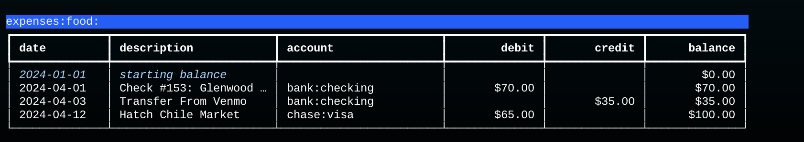
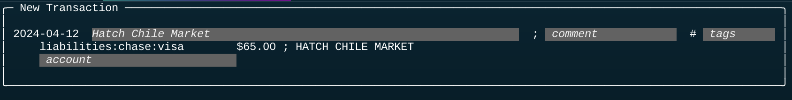
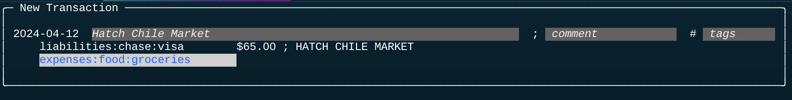

# Command Line API

Dexter is a command line application.
After it is installed you can run it simply by typing "dex" and a command name that tells Dexter what you want to do (initialize a database, import records, print a report, _etc_).

## Subcommands

If you try running it with no arguments you will see a usage message:
```
$ dex
usage: dex [-h] [--dbname X] ... {config,info,init,import,export,...}
usage: dex [-h] [--dbname X] ... {audit,export,fill,import,... setup}
```
The first part of the message lists command line options common to all commands, and the last part of the line is the list of all the command names.

To get help for one of the commands, type the command name and then `--help`, _e.g._
```bash
$ dex init --help
usage: dex init [-h] [--force] F

positional arguments:
  F           name of file with account definitions

options:
  -h, --help  show this help message and exit
  --force     replace an existing database
```

## Options

Most commands have options, which are typed after the command name.
For example, this command prints a report (based on the tutorial database) that shows all food related expenses before April 15:
```bash
$ dex report expenses:food: --end_date 2024-04-15
```

The output is a table (formatted with a Python library named Rich):



## REPL

The `review` command is the best example of why we use a command line API for Dexter.

When we run `dex review` the script queries the database to find all unpaired postings.
The script then uses a "read-eval-print loop" (REPL) to display the postings one at a time.
After it displays a posting it waits for user input to tell it how to fill in the missing information that is needed to create a new transaction.

In this example, the CSV record was from a credit card account.
The second line in the box shows the data extracted from the file:  the account name, the amount, and a description:



The gray boxes on the first and third lines are for values we can fill in.
We have to supply a transaction description (top line) and the name of the expense account (bottom line).

This is what the scren looks like after the user has supplied the required data.
The comment and tags are left blank, but the account has been filled in:



There are two important points in this example:

* The account name was entered using a library named `readline`.  The name of the library might not be familiar, but you probably use it all the time:  it's what shells use to implement command completion and command line editing.  To enter that account name, I just had to type "gr" and hit the tab key; Dexter realized that was enough to complete the name to `expenses:food:groceries`.

* The description, which is shown in white letters, was suggested by Dexter.  It looked at the description from the CSV file, which was in all capitals, and used a pattern matching rule to turn it into mixed case.

In all it took six keystrokes to process this record:  one to open the account editor, two to type the account name, tab to complete the name, return to close the editor, and one last keystroke to tell Dexter to save this transaction and move on to the next one.
