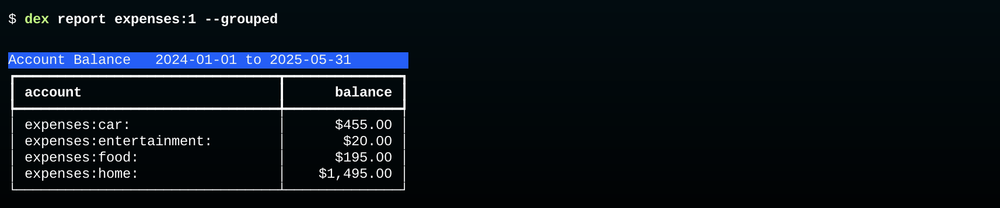
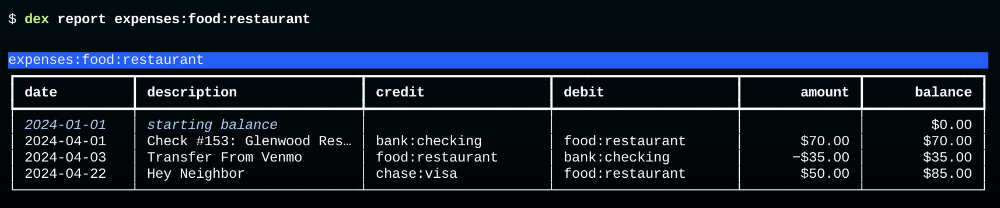
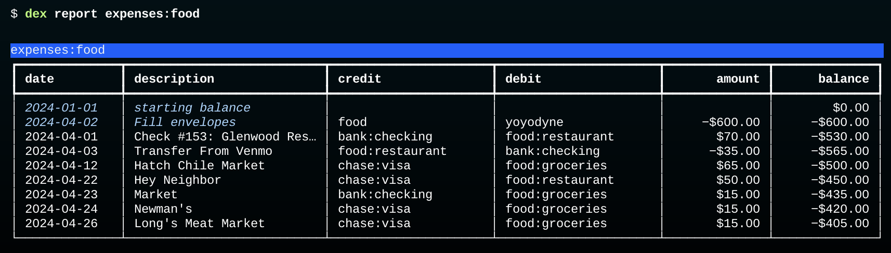
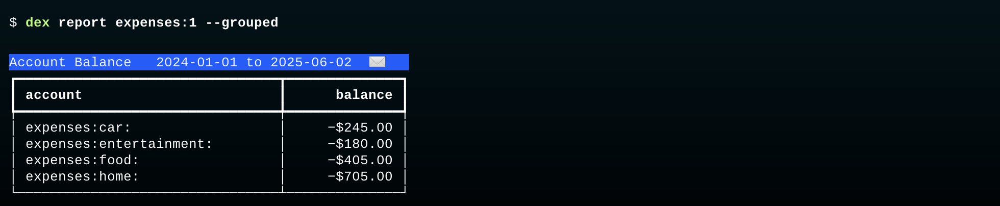

# Fill Envelopes

This report shows us how much we spent in each expense category:



The total in each category is the net amount -- the sum of debits (inflows) minus the sum of credits (outflow).
We can see that in detail in the `restaurant` category:



In this section we are going to add the budget transaction that fills the   envelopes for each expense category.
What we will see is that the budget transaction changes the meaning of expense account balances: when that transaction is added, the balance is interpreted as "the amount of money left in the envelope" ([Envelope Budgeting](envelopes.md)).

> _**Note:**  In the current version of Dexter budget transactions are added to the database by an `import` command.  In future versions there will be a `fill` command that automates several of the steps described here._

## Create the Budget Transaction

Use a text editor to create a new transaction in Journal format.

* The first line should have the transaction date and a brief description (and optionally a comment with extra information).
* The second line should have a posting with the name of an income account that has money we want to distribute to envelopes adn the amount of money we want to distribute
* The remaining lines will have the names of expense accounts and the amount of money we want to put in the envelopes for those accounts.

Here is the transaction to use for the tutorial project.
It allocates most of the monthly paycheck from Yoyodyne (which was for $5,000)  to the four expense categories:

```plain
2024-04-02  Fill envelopes                     ; Apr budget:
    income:yoyodyne             $4700.00
    expenses:car                -$700.00
    expenses:entertainment      -$200.00
    expenses:food               -$600.00
    expenses:home              -$2200.00
```

That transaction is in a file named `fill.apr.journal` in the project directory.

> _**Important:** Note the transaction has a `budget:` tag.  The tag is optional, but if it's there Dexter will be able to remove budget transactions from reports (why that's useful is explained below).

## Import the Budget Transaction

Type this command to preview what will be imported:

```bash
$ dex --pre import fill.apr.journal
None   multiple   yoyodyne                     Fill envelopes   #budget
```

Two things are worth noting:  

* the credit column says "multiple", meaning this transaction will credit more than one account (which is true).

* the last item on the row is `#budget`, which is Dexter's syntax for a tag named "budget".

Type the command again to add the transaction to the database:

```bash
$ dex import fill.apr.journal
```

## Print Food Expenses

If you look back at the budget fill transaction, you'll see the posting that fills the food envelope put $600 in the account named `expenses:food`:

```plain
    expenses:food               -$600.00
```

That's the parent account for `expenses:food:groceries` and `expenses:food:restaurant`.
Any expenses in those two accounts are automatically taken from the food envelope.

A quick reminder of how Dexter does envelope budgeting (introduced earlier in [Envelope Budgeting](envelopes.md):

* an envelope is an expense account
* filling the envelope sets a negative balance by crediting the account
* purchases, which debit the account, add a positive amount, moving the balance closer to $0
* if the balance ever gets to $0 it mean the total purchases exceed the original allocation

This command prints a report for all food transactions, including the envelope filling transaction:



This is just what we expect!

* the envelope was initially empty
* the fill transaction credited the account for $600, setting the balance to -$600
* a purchase on Apr 1 took $70 from the envelope and the balance increased to -$530
* the next transaction put $35 back in the envelope, so the balance is -$536

The remaining transactions all debited the expense account, taking more money from the envelope.
At the end of the month the balance was -$405.

This agrees with the summary shown earlier, which said we spent $195 on food.
We put in $600, spent $195, and have $405 left.

## Print a Summary of All Expenses

This command groups all expenses by the main category (food, car, _etc_):



The items in the last column show the money left in each envelope at the end of the month.
