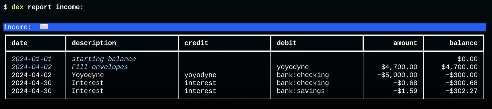
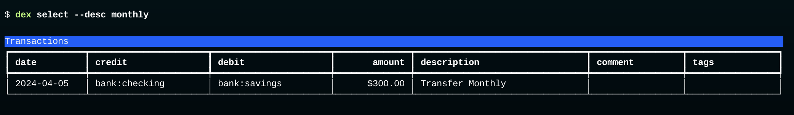
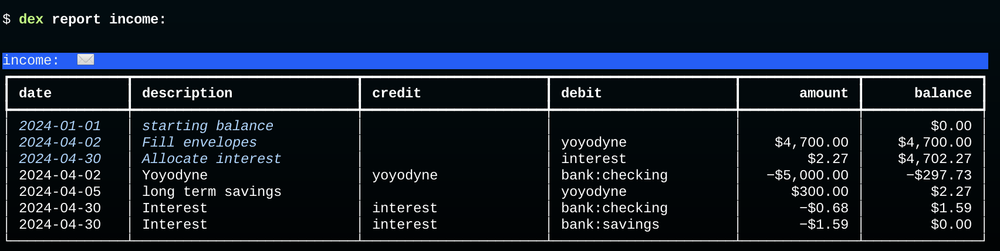

# Review Income

The envelope filling transaction also changes the interpretation of the balance on income accounts.
When there are no budget transactions the balance on an income account is the total amount of income from that source.
A budget transaction changes the interpretation to "the amount of unallocated income."

This is a report of all income accounts in our database after adding the bucket fill transaction:



There are three transactions in this table that are records of when money was deposited in one of our accounts.
There is one paycheck, for $5000, deposited into the checking account on Apr 2.
There are also two interest deposits, one to each bank account, on Apr 30.

These three transactions are the last three rows in the table.
As you can see, each of them credits an income source and debits an asset.
The credit decreases the balance in the income account.
Without the budget transaction the total balance would be -$5002.27: $5000 from Yoyodyne and $2.27 in interest from the bank.
The balance would correspond to the sum of all income from all sources.

The budget transaction (the second row) has the opposite effect on the balance.
Since it debits an income account, it moves the balance in a positive direction.

The fact that there is a final balance of -$302.27 tells us we have $302.27 in unallocated funds.
That makes sense:  we only put $4700 of our $5000 salary in expense accounts, and we haven't found a home yet for the interest income.

## Put Interest Income in an Envelope

If we want to make sure "every dollar has a job" we should decide on a place to put the interest income.
It's a tiny amount, but it can add up, especially if we're lucky enough to have CD accounts or high-yield savings accounts.

The question is, which envelope should we put it in?
If you want to put it in the entertainment envelope create a new Journal with this transaction:

```plain
2024-04-30  Allocate interest               ; Apr budget:
    income:interest              $2.27
    expenses:entertainment      -$2.27
```

Save it in a file named `interest.apr.journal` and import it into the database:

```bash
$ dex import interest.apr.journal
```

## Add a Budget Transaction for the Transfer

Our example data set includes a transfer from the checking account to the savings account to set aside $300 for long term goals.

That transaction is in the database, which we can see by typing this query, which looks for transactions with the word "monthly" in the description:



We need to add another new transaction to account for this in our budget.
Making a record of the fact that we're allocating $300 to long term savings is easy enough: we just need to add another debit to the `ypyodyne` account.
The budget transaction from the last section had this posting to allocate $4700 to various envelopes:
```
    income:yoyodyne             $4700.00
```
We'll do the same thing in the new transaction:
```plain
    income:yoyodyne              $300.00
```

But now the question is, which account do we use for the credit?
We clearly don't want to put it in one of our existing expense accounts.
One could make a case that "long term savings" is an expense and create an account with that name.

But there is a better solution, and one that makes sense phisophically.
We'll **debit the `equity` account**, the account that represents our "external" wealth.

Create a new file named `savings.journal` and add this transaction, using the same date as the bank transfer:
```plain
2024-04-05 long term savings
    income:yoyodyne              $300.00
    equity                      -$300.00
```

`equity` is the account that was used to set the initial balances of our assets:
```plain
2023-12-31 initial balance
    assets:bank:checking   $1,000.00
    assets:bank:savings    $2,500.00
    equity                -$3,500.00
```
The value on the last line is the sum of the amounts we had in all our asset accounts.
So basically what we're doing with the new transaction is saying "we are $300 richer than we were."

Type the shell command that imports `savings.journal`:
```shell
$ dex import savings.journal
```

Finally, print the report for income accounts:



That's it!
The $0.00 balance on the last line means we have accounted for all money deposited in our asset accounts this month, either allocating it to an expense envelope or putting it away in our long term savings.
