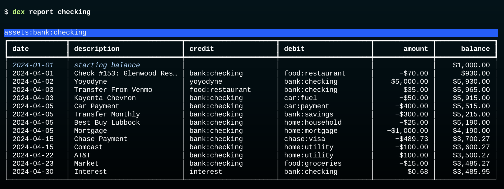

# Reports

The `report` command is similar to `select`, in that it will print tables showing transaction data.
The differences are:

* `report` automatically organizes data by account name
* the tables include account balances
* data can be grouped to show total amounts in each account

## Single Account

To see a list of all transactions in an account type the account name after `report`.
The name can be a full name, _e.g._ `assets:bank:checking` or an abbreviated name, _e.g._ `checking`:

There will be one row for each transaction where the account is used either as the credit (source) account or debit (destination) account.

Since we asked Dexter to print a report for the `checking` account, that account name should show up in either the `credit` column or `debit` column of the table.
Notice how when `checking` is in the credit column the transaction was taking money from `checking` and moving it to the other account and the amount is negative.
The opposite is true when `checking` is the debit account: the other account is the source in the credit column and the amount is positive.

> _**Note:** for brevity the initial part of an account name (`income:`, `expenses:`, _etc_) is not printed.

## Multiple Accounts

If more than one account is entered Dexter will print a table for each account:

Since one of our transactions was a transfer from checking to savings that transaction appears in both tables.
In the checking account table the account was the credit account and the posting decreased the account balance, but in the other table the account was the debit account the the posting increased the balance.

## Include Subaccounts

If the account name ends with a colon Dexter includes transactions for that account and all of its subaccounts.

For example, we have an account `expenses:food` with subaccounts `expenses:food:groceries` and `expenses:food:restaurant`.  This command prints a table will transactions from all three accounts:

The balance on the last line shows that we spent a total of $195 on food in April.

## Separate Tables for Subaccounts

The notation `X:` means "make a single table using account `X` and all its subaccounts".

A slight variation is to put a number after the colon.
`X:n` means "make separate tables for X and all its subaccounts `n` levels down".
So `expenses:food:1` tells Dexter to print a table for `expenses:food` and its two top level subaccounts:

The first table is for `expenses:food`.
We didn't have any transactions for this category -- all our purchases went to either `groceries` or `restaurant` -- but this account is available for miscellaneous purchases (snacks?) that don't fit in either of the subaccounts.

### Subsubaccounts

We don't have any subaccounts below `groceries` or `restaurant`, but if we did those would be put in the corresponding table.

For example, we might add new accounts named `expenses:food:restaurant:fastfood`, `expenses:food:restaurant:fancy`, _etc_.
Any expenses in those categories would be collected into the restaurant table.

If we have those extra subaccounts we can print separate tables for them, too, by specifying `expenses:food:2` on the command line, meaing "separate tables for `food` and all subaccounts down two levels."

### Notation

A mnemonic for rememberis the difference between `X:` (without a level number) and `X:n` is to think of the colon at the end as an asterisk in a shell command:  "expenses:food:" is like "expenses:food*", which is a pattern that would match any file with a name that starts "expenses:food".

> _We considered using an asterisk instead of a colon at the end of an account name but that makes it harder to type the shell command since shells have their own meaning for the asterisk.  We would have to put single quotes around the account name and type_
>
> `$ dex report 'expenses:food*'`
>
> _A future version might accept either notation.

## Groups

A `--grouped` option along with a name pattern that would make separate tables tells Dexter to compute the balance of each table and then collect the results into a single table to print:

