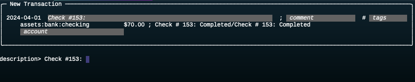
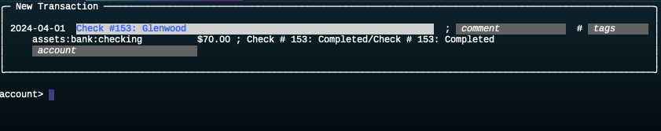
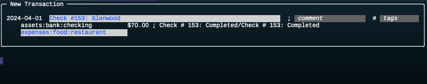
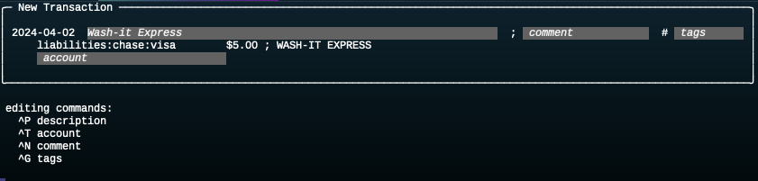

# Review Unpaired Entries

After importing a batch of CSV files, the `pair` command will automatically generate matches for most of the new postings, but there will probably be several more that need to be processed by hand.

The `select` command (described in more detail below) has a set of options that will print a table showing all the unpaired entries:
```
$ dex select --entry --tag '#unpaired'

Entries                                                                                                                       
┏━━━━━━━━━━━━━━┳━━━━━━━━━━━━━━━━━━━━━━━━━━━┳━━━━━━━━━━━━━━━━━┳━━━━━━━━━━━━┳━━━━━━━━━━━━━━━━━━━━━━━━━━━━━━━━┳━━━━━━━━━━━━━━━━━┓
┃ date         ┃ account                   ┃          amount ┃   column   ┃ description                    ┃ tags            ┃
┡━━━━━━━━━━━━━━╇━━━━━━━━━━━━━━━━━━━━━━━━━━━╇━━━━━━━━━━━━━━━━━╇━━━━━━━━━━━━╇━━━━━━━━━━━━━━━━━━━━━━━━━━━━━━━━╇━━━━━━━━━━━━━━━━━┩
│ 2024-04-01   │ checking                  │         $300.00 │   credit   │ Check # 152: Completed/Check … │ #unpaired       │
│ 2024-04-01   │ visa                      │           $3.00 │   credit   │ WASH-IT EXPRESS                │ #unpaired       │
│ 2024-04-03   │ checking                  │         $203.00 │   credit   │ KAYENTA CHEV-XX6444 JUNCTION … │ #unpaired       │
│ 2024-04-03   │ checking                  │         $503.00 │   credit   │ HIGHWAY 160 HIGHWAY 160 Kayen… │ #unpaired       │
│ 2024-04-05   │ checking                  │          $21.58 │   credit   │ Best Buy/NST BEST BUY #226  0… │ #unpaired       │
...
```

## Overview

To start the review process simply type the command name:
```shell
$ dex review
```

Dexter will show us the unpaired postings one at a time.
It will create the outline of a new transaction, leaving blanks for places we can fill in.
The display will be a table that has the general shape of a transaction in Journal format:

* the top line will have the date and transaction description
* the next line will be the posting corresponding to the CSV record that was imported
* the third line will be the outline of a new posting where we need to supply the account name

This is what the display looks like for the first entry shown above:


The blanks we can fill in are shown with a light background and a reminder of what goes in that blank.

After we fill in the description and account fields for this transaction the display will look like this:


The filled-in fields are displayed in a different color to indicate they have been edited.

Every new transaction must have the description and account fields filled in; the comment and tags are optional.
At this point we can save current transaction.
They display will be updated to show the next unpaired entry from the list.

## Philosophy

The obvious question at this point is, why go to all the effort to make a new command just to review postings?
Wouldn't it be easier to export the data to a spreadsheet of other application and let users work with a GUI they are already familiar with?

The answer is that Dexter's command line interface is much more efficient.
With a GUI display in a spreadsheet or text editor, users choose items that need to be updated.
They click on an item and then edit one or more fields.

Dexter knows which items need attention, and it displays them to us one at a time.
The efficiency comes from being able to use features like command completion and command line editing to update the current item.
In many cases it can take only a few keystrokes (and no mouse clicks) to fill in the missing data and move on to the next item.

## Example

Let's work through the steps used to edit the posting shown above, which will illustrate several of Dexter's time-saving operations.

At each step we'll start an edting operation by typing a single keystroke.
The notation &#8963;X is short for "control-X", _i.e._ hold down the control key when typing X.

### Auto-Fill Command

The description field in a new transaction is blank because none of the regular expressions matched the description in the CSV record.
The CSV description is useful, however, so Dexter saves it as part of the posting.
You can see the CSV description ("Check # 152: ...") on the right part of the second line.

The auto-fill command (&#8963;F) copies information from the posting description and inserts it in the transaction description area.

* the first time we hit &#8963;F Dexter copies the posting description
* the next time we type that Key Dexter will apply the "fill" and "sub" regular expressions mentioned briefly in [Regular Expressions](tut_regexp.md#fill-and-sub-rules) and insert the result
* if we hit &#8963;F a third time the area goes back to the original blank state (with just the placeholder)

This is what the terminal window shows after hitting &#8963;F the first time:


And this is the window after the second &#8963;F:


The regular expressions (described below) have stripped away all of the extra text following the colon.

> You can hit &#8963;F a few more times to see how Dexter cycles through the three alternatives.
Make sure it is displaying the third alternative (created by the regular expressions) before moving on to the next step.

### Edit the Description

Notice how the text displayed in the transaction description area is still in italics.
That's because the fill command simply makes suggestions for what the description should look like.
We often want to edit the field to refine that suggestion.

To edit the description field hit &#8963;P.

> The "P" is short for "payee".  We can't use &#8963;D because that's a Unix convention for signalling the end of input and the command to exit the program.

This is what the screen will look like:



Whenever you are editing a field, Dexter will prompt you to enter the contents.
It will print a line with the field name followed by a greater-than sign and then the current contents of the field.
In this example, it printed the suggested contents of the description field.

The cursor is at the end of the line, which means we just need to type in the name of the person or business we wrote the check to.
Type "Jerry's" and hit the return key.

Now the new transaction will look like this:


The most important thing to notice here is that the text format has changed: it's now blue on a white background.
That means the field has been edited and has a value that will be saved in the database.

#### Command Line Editing

Dexter uses a popular library named Gnu Readline to control the editing of fields.
You are probably already familiar with the keystrokes you can use, since most shells use this library (or an equivalent).

* use &#8963;A or &#8963;E to move the cursor to the front or end of the line
* use the arrow keys or type &#8963;B or &#8963;F to move backward or forward one character
* type ESC followed by B or F to move backward or forward one word at a time
* type DEL to delete the character to the left, ESC DEL to delete the word to the left
* &#8963;U deletes the entire line

The complete set of editing keys can be found in the Reference section, in [dex Review](dex_review.md).

### Edit the Account Name

To edit the account name in the new posting type &#8963;T.

> The "T" is short for "to", since this posting is usually the destination (credit) account in the transaction.

As before, Dexter prints a new line for you to enter the account name:



This is where another traditional command line editing feature will be very useful.
You can type part of a command name and then hit the tab key.
If the part you typed is sufficient to distinguish the account from all the other accounts Dexter will fill in the rest of the name for you.

Suppose this transaction is something that should go in the household expenses category, `expense:home:household`.
That account has an abbreviation of "household".
Type "house" and hit the tab key.
Dexter will fill in the rest, and the line will show "household".
Now hit the return key, and you can see Dexter has expanded the abbreviation into the full account name:



#### Notes on Line Completion

If you're entering a string and hit the tab key and nothing happens it probably you didn't type enough to disambiguate the account you want from other accounts.
Hit the tab key a second time and Dexter will show you all the accounts that start with the text you typed.

For example, if you just type "ho" and hit tab nothing happens.
Hit tab again and this is that you'll see:


Dexter is saying there are two accounts that start with "ho":  "home" and "household".
At this point just continue typing.
Since we want "household" in this case just typing "u" and tab is enough.

> **Note:**  The other reason you won't see anything happen when you hit the tab key is that you misspelled an account name.  For example, if you type "hoo" you can hit the tab key as often as you want.  Dexter is telling you no account starts "hoo".

## Accept Changes

The last step is to tell Dexter we're done with this transaction.
Type &#8963;A (the "A" is for "accept").

Dexter will add the new posting and the new transaction to the database and move on to the next unpaired posting.

## Exit

To exit the program type &#8963;C or &#8963;D.

You can verify the new transaction and posting were added to the database:

* if you run `dex info` you will see the count in those two columns has increased by one
* you can run the `select` command that prints the list of unpaired entries (shown at the top of this page) to see that the check posting is no longer on this list.


## Restart

When you restart Dexter to work on the remaining transactions add an option to the `review` command:

```shell
 dex review --fill_mode 2
```

That tells Dexter to automatically fill each transaction description.
Mode number 2 is "apply regular expressions to the posting description".
Now we don't have to type &#8963;F -- it will be done already.

> If you want to use another mode for any transaction you can still type &#8963;F to cycle through the modes.

## Display Help

If you need a reminder of which control keys trigger the editing operations just type a question mark when Dexter is showing a transaction.
This message will be displayed:




## Fill in the Second Transaction

The next transaction was a purchase at a car wash.

Type &#8963;T to edit the account, and enter `expenses:car` for the account.
You can type "ex" and tab, and the line will expand to "expenses".
Now type a colon and "ca" and tab again, and the line will show "expenses:car".

Hit return to enter that name in the transaction box.
The display will look like this:


Next, look at the filled in transaction description.
The regular expression has transformed it into "title-case":  the first letter in each word is capitalized, the rest are lower case.
There's no need to edit this field -- it's just what we would have put there ourselves.

Here's an important optimization:  hit the &#8963;A key now, and Dexter will use the suggested description.

> _A transaction can be saved if the account is filled in and the description field has either been edited or has a string created by an automatic fill._

Note that the word "description" in the box is a placeholder that means "the description goes here" -- it is not auto-filled text.

## Fill in the Third Transaction

The next transaction was at a gas station in Kayenta, Arizona.

Edit the description field.
Hit &#8963;P, and the suggested description is displayed on the terminal, with the cursor at the end of the line.

* type &#8963;A to move the cursor to the front of the line
* type ESC F twice to move the cursor right after the "v" in "Chev"
* type &#8963;K to erase the rest of the line
* type "ron" to fill out the rest of the business name

The line should now say "Kayenta Chevron".
Hit the return key and that line will be saved as the transaction description.

This exercise illustrated another subtle point:  when we're editing a field, keystrokes can have a different meaning.
Here &#8963;A meant "move the cursor to the front of the line", but in the main loop it means "accept this transaction and move to the next one."

The reason for this is that field editing is controlled by the GNU readline library and it uses its own meanings for keys.
If you're used to editing shell commands the keys will be familiar and it won't be any trouble caused by different meanings when editing a line.

The next step is to enter an expense category using &#8963;T to edit the account field.
The first inclination is to choose "fuel".

But this gas purchase was part of a trip to the Southwest, so a better choice might be the travel envelope.
Type "tr" and tab and the account is expanded to "travel", and that will be converted to the full "expenses:travel" account name.

> _If you had already entered "fuel" it's easy to change.  When you hit &#8963;T the line will show the current setting, "expenses:car:fuel", with the cursor at the end of the line.  Type &#8963;U to delete the entire line, then type "tr" and tab to change it to "travel".

Finally, suppose we want to keep track of all expenses related to this trip.
That's where tags are useful.
Choose a short but descriptive tag name, like "swrt", short for "southwest road trip".
We can add this tag to any transaction, not just those in the travel category, and later we can make a report that shows all transactions tagged "swrt" to see what we spent on the trip.

To add a tag, type &#8963;G to bring up the line editor.
Type "swrt" and hit return.

#### Tag Syntax

Tags are short strings of letters and digits.

When they are displayed in reports they will have a hash symbol at the front.

When you are entering them, you can type one or more tag names.
The hash symbol is optional (Dexter adds it for you), and you can enter multiple tags, separating them by spaces or commas.

## Complete the Remaining Transactions

The table below shows the remaining unpaired transactions.
We leave it as an exercise for you to continue using the loop in the `review` command to update the transactions.

If you want to take a shortcut, you can download a file named `apr.2024.docs` from the GitHub repo and use it for the remaining steps in the tutorial.

