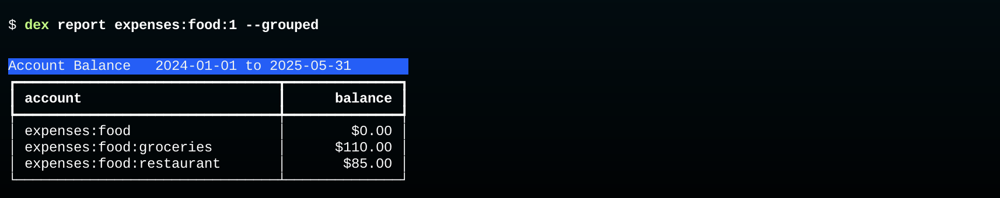

# Monthly Workflow

The standard workflow assumes transactions are saved in a database.
Each month a new batch of CSVs is downloaded, added to the database, and refined into a set of transactions.

Because the scripts that initialize a database can read `.journal` files from hledger there is an aternative workflow for users who just want to use Dexter to convert CSV files into transactions or for envelope budgeting.
In this workflow, a temporary database is created using account definitions, new records are loaded from CSV files, and the results are written back out in a `.journal` format that can be read by hldeger.
See [hledger Workflow](hledger.md) for details.


## Download CSVs

In the current version of Dexter the records from a financial institution need to be saved in files that have names based on the account they will be loaded into.
For example, if you have a Chase credit card, and the account you set up for it in Dexter is named `liabilities:chase:visa`, you will download a month's worth of transactions and rename it `visa.csv`.

> A future update will be able to work with CSV files downloaded from Mint.com and other "aggregators".  These services automatically connect to financial institutions and then let you download a single CSV will all your transactions.  In this case Dexter will get the account name from the CSV records instead of the CSV file name.

## Import CSVs

If you move all your CSV files to the same folder you will be able to import them with a single command, _e.g._

```
$ dex import Downloads/*
```

Each line in each CSV will become a single **unpaired** posting that needs to be matched with another posting in order to turn it into a transaction.

## Create Transactions

The goal now is to create Transaction records by pairing the new postings using the `pair` command.

There are two ways Dexter will do this:

* Dexter first looks for matching halves of transfers.  For example, if you transfer money from your checking account to your savings account, Dexter will have found a debit in one CSV file and a credit in the other.  The `pair` command will create a new transaction and save it in the database.

* Next it uses pattern matching rules.  For example, we often buy fish at a store named "Newman's Fish Market".  Our database has a rule that says whenver a credit card has a purchase at Newman's it can create a new debit posting to `expenses:food:groceries` and create a new transaction using the CSV record and the new posting. 

## Review Unpaired Records

There will always be postings that cannot be paired automatically.
For example, if we buy something from Amazon.com, the record in the CSV file will simply have something like "AMZN Mktp" with no indication of what we purchased.
In these cases we have to review the postings one at a time to clean up the description and assign an expense category.

As described earlier, the `review` command uses a read-eval-print loop that lets us supply the missing information with a minimum of keystrokes.

## Fill Envelopes

The next step is to add the transaction that fills the budget envelopes.

> Currently this is done by using a text editor to create a transaction in Journal format.  Edit the transaction with to have the correct date and make sure the amounts balance, then import the file with `dex import`.

> A future update will add a new command, `dex fill`, that will automatically find the most recent deposits and create a new bucket transaction.

## Reports and Backups

The remaining steps are optional.

A `select` command can print a table showing transactions or postings that match various constraints.
For example, this will print all recent grocery purchases that were more than $100:
```bash
$ dex select --month may --min_amount 100.00
```

The `report` command can generate tables showing account balances, containing either individual records or a summary grouped by account name.



Other commands described in the reference section include:

* `dex save` saves records in a JSON-like format as a way of backing up the database
* `dex restore` will create a new database from saved records
* `dex list` will print information about the database, for example lists of account names
* `dex audit` runs various consistency checks


